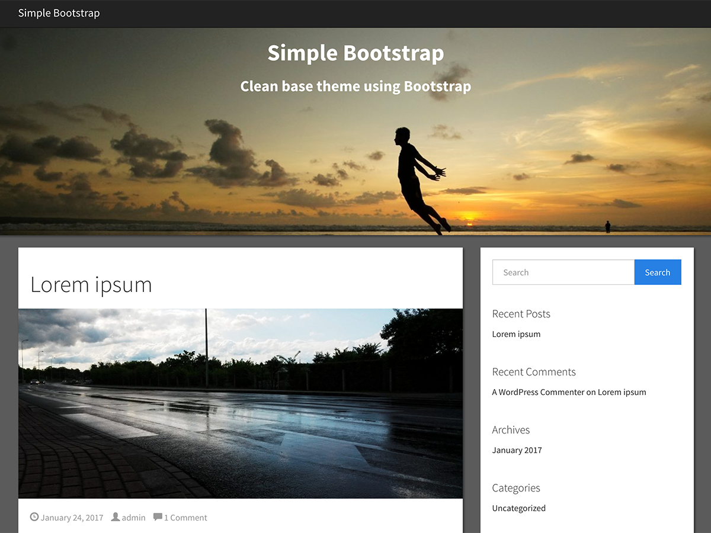

# Wordress Simple Bootstrap

[](https://travis-ci.org/nicolas-van/wordpress-simple-bootstrap) [](https://wordpress.org/themes/simple-bootstrap/) [](https://wordpress.org/themes/simple-bootstrap/)

Simple Bootstrap is clean base theme to use Twitter Boostrap 4 with Wordpress, aimed at being a starting point for developers to build their own themes using Bootstrap.

<p align="center">
  
</p>

* Very clean default graphical aspect.
* Clean code designed to be modified by theme creators.
* All base features of Wordpress themes (sidebars, menus, footer, header image, background, etc...)
* All the features of Bootstrap 4, perfectly integrated with Wordpress.
* Fully responsive.
* Designed to use SCSS.
* Integrates Font-Awesome for the icons.

## Links

* [Theme page on Wordpress.org](https://wordpress.org/themes/simple-bootstrap/)
* [Test this theme](https://wp-themes.com/simple-bootstrap/)

## Extension guide

Let's state it clearly once and for all: trying to put some CSS above a pre-compiled Bootstrap is a very bad practice. The proper way to extend Bootstrap is to alter its behavior using [SCSS](https://sass-lang.com/) and to re-compile it. Here is how to do so.

### Requirements

* [node.js](https://nodejs.org/en/)

### Install dependencies

```bash
npm install
```

### Modify SCSS files

They are located in the `scss` folder.

### Compile SCSS files

```
npm run build
```

## Report issues and contribute

[See the contribution guide](./CONTRIBUTING.md).

## License

[See the license file](./LICENSE.md).
